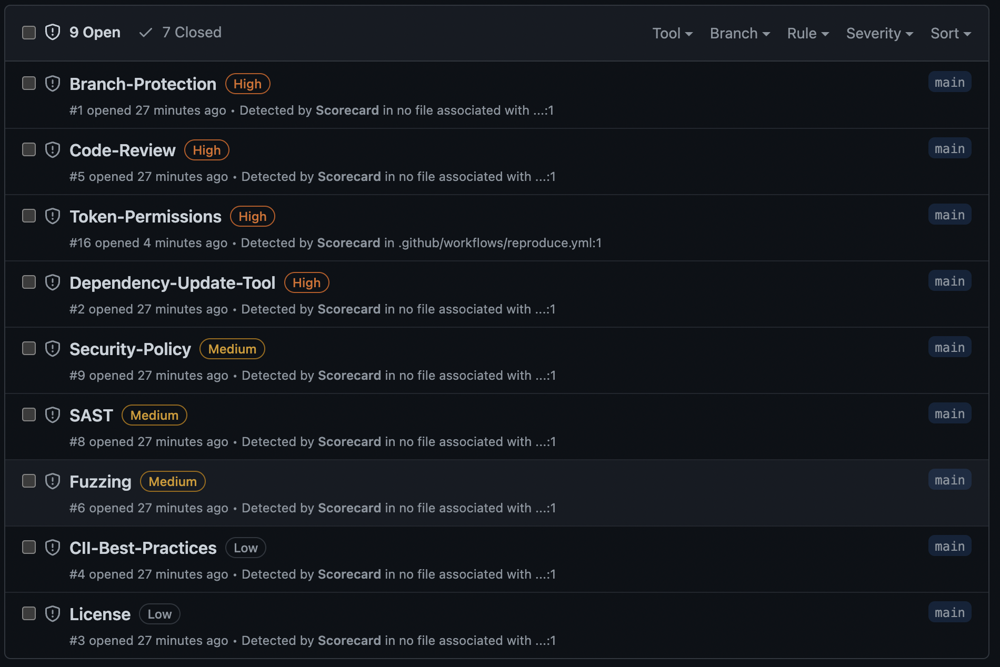

# Purpose

This repository exists to reproduce the bug https://github.com/ossf/scorecard/issues/2189

# Actual Scorecard test result

# Expected result

It should report Unpinned third party github action for the [reproduce-composte](./.github/actions/reproduce-composite/action.yml) and [reproduce-docker-path](./.github/actions/reproduce-docker-path/action.yml) actions. It works automatically for docker actions with a Dockerfile (which is a more common use case).

